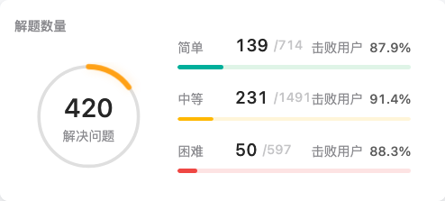

### 2022年10月07日17:00:52

#### 1. 当前进度: 全站排名34,178

#### 2. 当前状态

* 几乎所有经典leetcode题目都已经刷过了, 并且都是在没有看题解的情况下独立完成的
* 解题时的one pass能力不足, 依赖系统给的测试用例来补全各种边角case, 有时程序的正确性都需要系统来判定
* 解题时思路不清晰, 面试环节的手撕代码也继承了这个问题

#### 3. 后续计划

* 思考: 我现在还能从leetcode上获得什么?我继续做这件事的**目的是什么**?
  * **基本数据结构的操作和应用**: 已经非常熟练, 现在应该做的是关注数据结构的底层实现, 并发能力等在工程上更关注的特性
  * **面试加分项**: 面试主要关注1. 科研学习能力 2. 工程能力 3. 计算机基础知识 4. 手撕代码; 其中手撕代码往往是最后一个环节, 所以它是一个加分项, 在面试过程中需要做到 1. 思路清晰 2. 能够准确分析时间复杂度 3. 代码pass
* 后续写题方式:
  * **复习经典旧题, 不写新题**: 前500题内未完成的经典题目除外, bash, sql等没有学习过的领域除外
  * 写题时注意解题routine, **以规范化流程解题**, 例如`认真审题`→`过一遍已给case查看是否正确理解题意`→ `查看输入限制`→`思考思路`→`代码实现`→`测试题目已给的用例`→`测试边界条件`→`测试极端测试用例`→`提交代码`, 这样在上机时解题效率会更高
  * 在git commit message里**写清楚这道题目的状态**: `性能排名`, `AC try次数`, `是否全部题解review`等
  * 写完题目关注**discuss**里的题解, 看看是否有其他的经典题解, 如果有也需要掌握, 并且对比不同题解的优劣
  * **整理题目涉及的知识点**, 例如哨兵, 数学定理, 并整理到文档中进行总结

